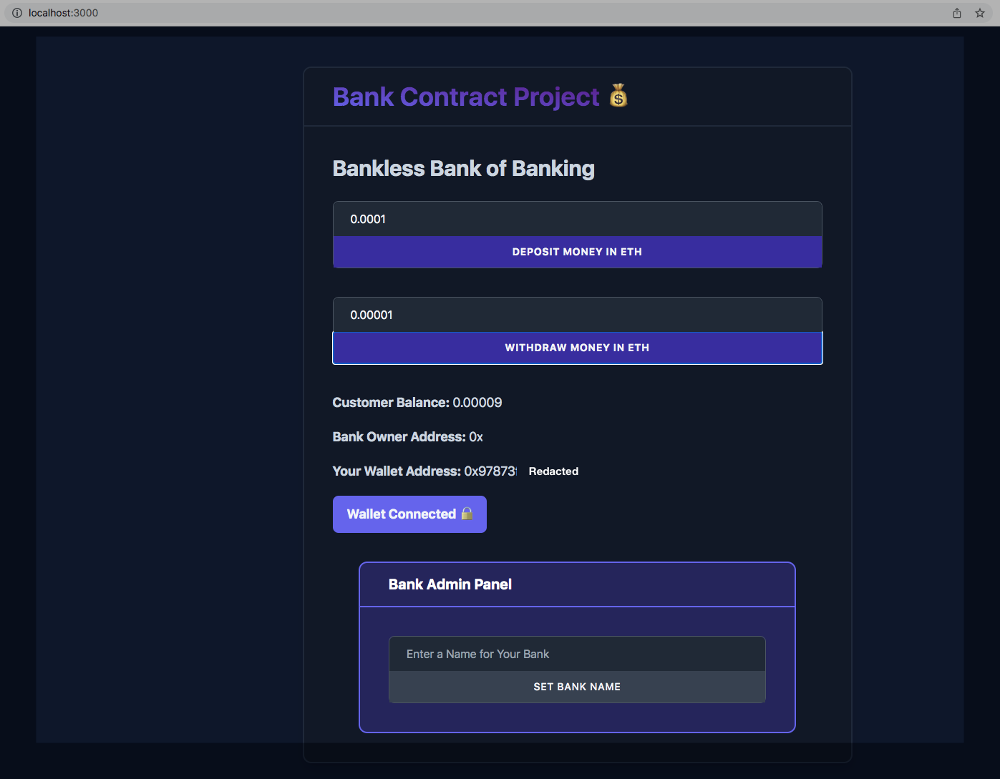

# Cadena Bank DAPP

This is the completed code for the Bank DAPP.

## To Install

Clone the project and run:

### `nvm use`

### `npm install`
### `npm start`

## TODO

- update App.js contract address as needed
- default contract address was deployed to the Ethereum Rinkby Test network
- contracts/Bank.json needs to be copied after compiling new json artifact from main parent app

## Screenshots

